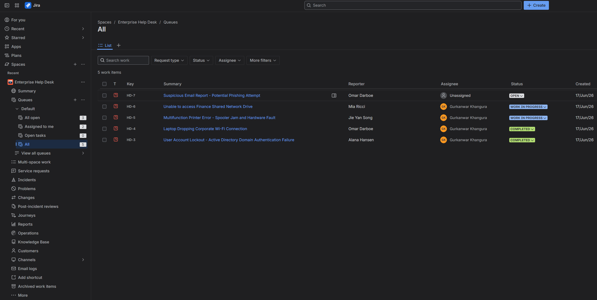
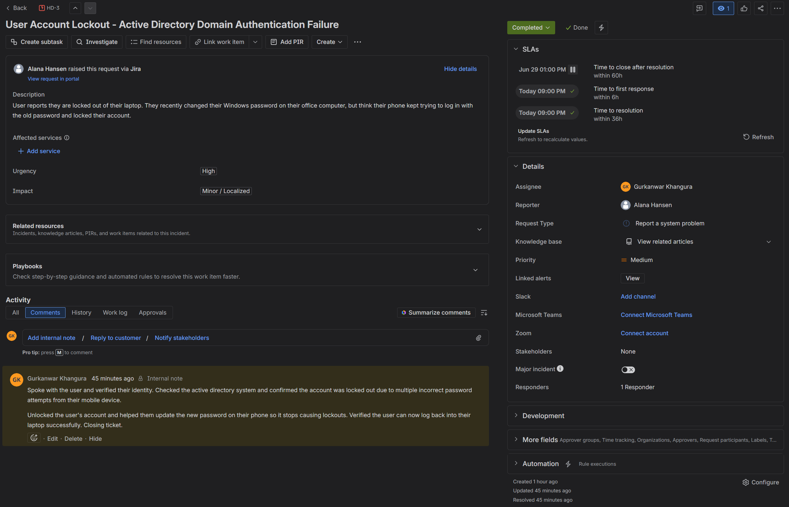
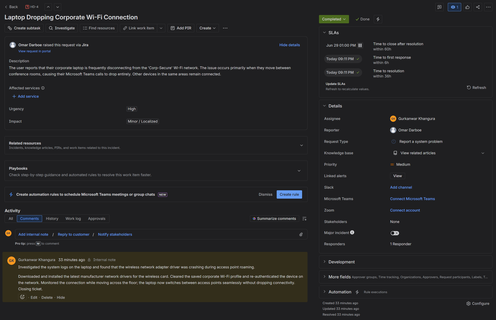
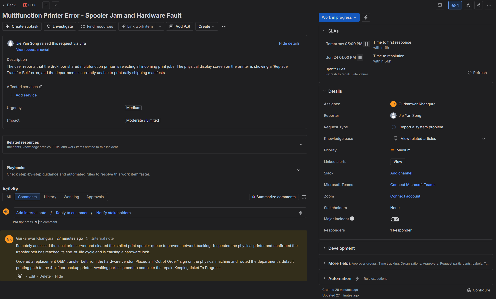
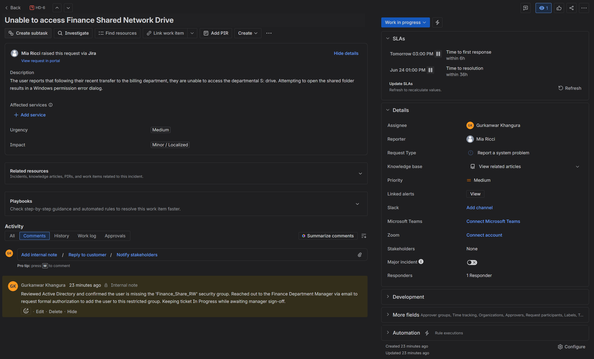
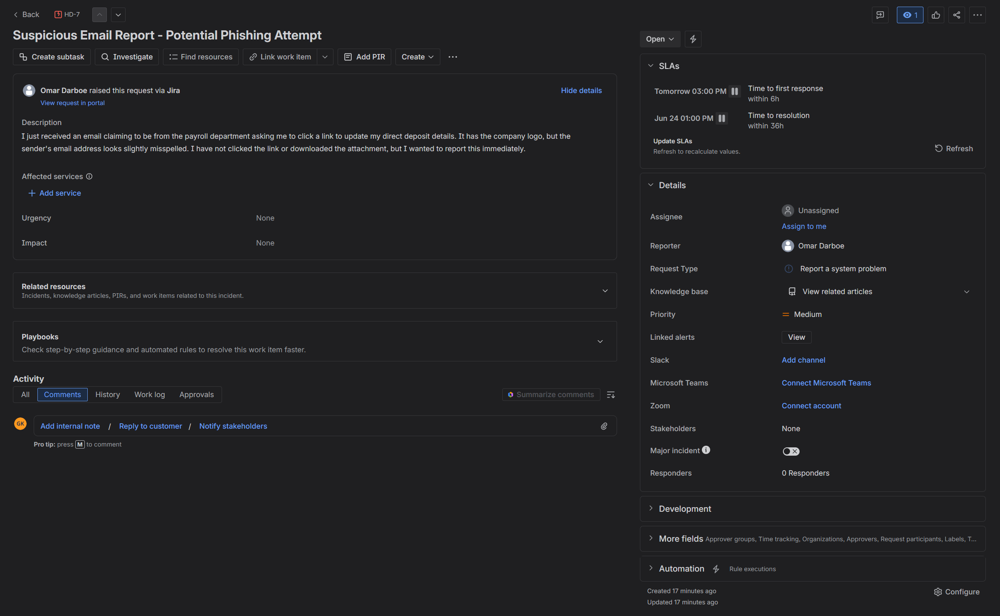

# Jira-Help-Desk-Lab
A simulated enterprise IT Help Desk environment built in Jira Service Management. This lab demonstrates practical incident management, active ticket lifecycles, SLA tracking, and professional technical documentation across identity management, networking, hardware, and security escalations.

## The Master Queue

**Queue Management Logic:** I structured this queue to reflect a realistic daily workload. I prioritized tickets based on urgency and user impact, ensuring that a high-priority security escalation remains highly visible while routine hardware issues are tracked in progress. 
**Key Takeaway:** Balancing SLA timers and managing different ticket statuses (Open, Work In Progress, Completed) is critical to keeping an IT department organized and users informed.

## Ticket Resolution Deep Dives

### Active Directory Lockout

**Troubleshooting Logic:** User account lockouts are rarely just "forgotten passwords." I investigated the root cause and identified that a mobile device was polling the network with stale cached credentials, repeatedly tripping the domain lockout policy. 
**Key Takeaway:** Applying identity management fundamentals means resolving the underlying sync issue, not just blindly unlocking the account, to prevent repeat help desk calls.

### Wi-Fi Network Troubleshooting

**Troubleshooting Logic:** A dropped connection during physical movement indicates an issue with access point handoffs. I checked the system logs, identified a crashing wireless adapter driver, updated the endpoint, and cleared the corrupted network profile to force a clean authentication.
**Key Takeaway:** Solid network troubleshooting requires moving past "turn it off and on again" and diving into device managers and system logs to ensure endpoint stability.

### Hardware Printer Failure

**Troubleshooting Logic:** When diagnosing the physical hardware fault (transfer belt failure), my first priority was mitigating the network impact. I cleared the stalled print spooler to prevent a backlog of local jobs and immediately routed users to a backup printer while waiting for vendor parts.
**Key Takeaway:** Effective hardware support involves managing vendor lifecycles and ensuring business continuity for the department while the physical machine is out of order.

### Folder Permission Access

**Troubleshooting Logic:** Rather than immediately granting the user access to a restricted financial drive, I verified their missing security group in Active Directory and paused the ticket to request written authorization from the department manager.
**Key Takeaway:** Strictly adhering to Role-Based Access Control (RBAC) and the Principle of Least Privilege protects the company from unauthorized data exposure and maintains a clean audit trail.

### Security Phishing Escalation

**Troubleshooting Logic:** This ticket represents a high-urgency security triage. I left this unassigned in the queue to demonstrate how a fresh security alert sits before a technician begins isolating the user's machine, analyzing the email headers, and confirming no malicious payloads were executed.
**Key Takeaway:** A security-first mindset means treating user-reported anomalies with immediate urgency and maintaining a zero-trust approach to unverified internal communications.
